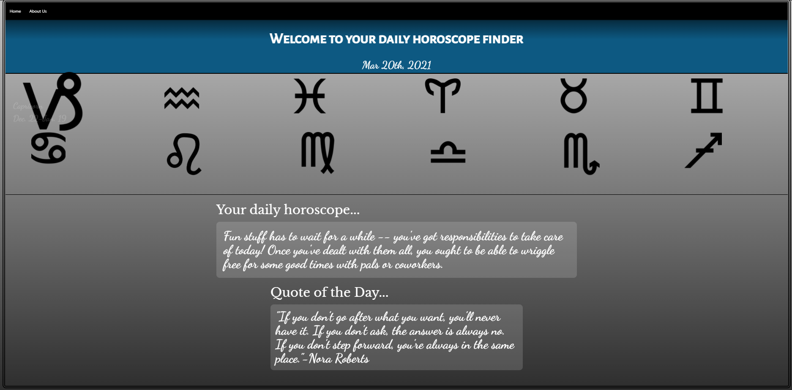

# Horoscope Finder

## Project Description 
simple explanation about the web application and used technologies

## Contributors
- Kyle
- Sam
- Ian
- Riheel

## User Story
```md
GIVEN I want to generate my daily horoscope based on my zodiac sign
Given I want a daily quote to be generated upon zodiac sign selection
WHEN I open the application "HoroscopeFinder"
THEN todays date will be displayed at the top of the application
WHEN I select my zodiac sign
THEN I am presented with my daily horoscope (API 1)
THEN I am presented with my daily quote (API 2)
WHEN I scroll down to the footer bar
Then I can select an About Me page
```

## Used Technologies
list of used tech stack here
- [Javascript](https://developer.mozilla.org/en-US/docs/Learn/Getting_started_with_the_web/JavaScript_basics/)
- [Materialize](https://materializecss.com/)
- [Aztro Api](https://rapidapi.com/sameer.kumar/api/aztro/)
- [Quotes Api](https://type.fit/api/quotes/)
- [Moment](https://momentjs.com/docs/)


## Installation
In order to acess and refractor the code you must first go through the Installation Process.
​
1) Open GitHub and navigate to the main repository 
​
2) Click the green "Code" button Above the top right corner of the files 
​
3) To clone the repository using HTTPS, under "Clone with HTTPS", click the clipboard icon. To clone the repository using an SSH key, including a certificate issued by your organization's SSH certificate authority, click "Use SSH", then click the clipboard icon. To clone a repository using GitHub CLI, click "Use GitHub CLI", then click the clipboard icon.
​
4) Open Terminal and navigate to the directory where you want the repository to be 
​
5) Type "git clone ", and then paste the SSH, CLI, or HTTPS link you coppied on GitHub and press ENTER 
​
This should put a copy of the repository into the directory you had chosen in step 1
​
## Usage
step by step of application use
​
​


​
[Check Out The Full Page](https://ianfletcher314.github.io/DailyCalendar/)
​
## Credits
​
- [GitHub's Document on Cloning Repositories (used in Instalation section)](https://docs.github.com/en/github/creating-cloning-and-archiving-repositories/cloning-a-repository) 
- [VS Code's ReadMe Page (used for formating and licensing syntax)](https://github.com/microsoft/vscode/blob/master/README.md)
​
## License 
​​
Licensed under the [MIT](Assets/license.txt) license